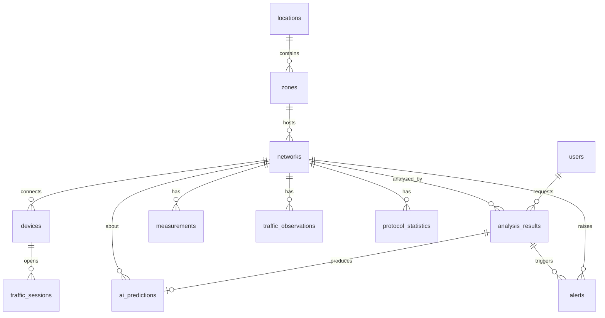

# Esquema de WiFiSense

## Tablas

| Tabla | Contenido | Claves y restricciones principales |
|---|---|---|
| `users` | Cuentas y rol | `username`, `email` únicos · `role` ∈ ADMIN/ANALYST/VIEWER · `password_hash` BCrypt |
| `locations` | Sedes | `name` único |
| `zones` | Áreas de una sede | FK `location_id` (CASCADE) · único (`location_id`, `name`) |
| `networks` | Redes Wi-Fi | FK `zone_id` (RESTRICT) · `bssid` único con formato MAC · banda, canal, seguridad, estado y fuente con CHECK |
| `devices` | Clientes y AP | FK `network_id` (CASCADE) · `mac_address` único con formato MAC · señal entre -100 y 0 dBm |
| `measurements` | Rendimiento por lectura | FK `network_id` · latencia/jitter ≥ 0 · pérdida 0–100 · `bandwidth`, `signal`, `connected_devices` opcionales porque no toda fuente los mide · `source` indica si es SIMULATION |
| `traffic_observations` | Volumen y paquetes por lectura | FK `network_id` · valores ≥ 0 · `observed_at` coincide con `measured_at` de la medición |
| `traffic_sessions` | Sesiones por dispositivo | FK `device_id` · puerto 0–65535 · `ended_at ≥ started_at` |
| `protocol_statistics` | Paquetes por protocolo y periodo | único (`network_id`, `protocol`, `period_start`) · `period_end ≥ period_start` |
| `analysis_results` | Resultado de cada análisis | FK `network_id`, FK `requested_by` (SET NULL; NULL = monitoreo automático) · `score` 0–1 |
| `ai_predictions` | Respuesta del modelo | FK único `analysis_result_id` (1:1) · `anomaly_score` 0–1 · `simulated_data` obligatorio |
| `alerts` | Alertas por cambio de estado | `status` ∈ OPEN/ACKNOWLEDGED/RESOLVED · CHECK: `resolved_at` existe si y solo si está RESOLVED |

## Decisiones

- **`ON DELETE`**: borrar una red borra su historial (CASCADE); borrar una zona con redes está prohibido
  (RESTRICT) para no perder datos por accidente; borrar un usuario conserva sus análisis (SET NULL).
- **Enums como `VARCHAR` + `CHECK`** en vez de tipos `ENUM` de PostgreSQL: agregar un valor es un `ALTER ... CHECK`
  sencillo y JPA los mapea sin configuración extra.
- **`TIMESTAMPTZ`** en todas las fechas; el backend trabaja en UTC.
- **`DOUBLE PRECISION`** para métricas: son mediciones físicas, no montos.

## Índices (V9)

| Índice | Consulta que acelera |
|---|---|
| `idx_measurements_network_time (network_id, measured_at DESC)` | Ventana de análisis e historial por red |
| `idx_traffic_observations_network_time` | Cruce de tráfico con mediciones |
| `idx_analysis_results_network_time` | Historial de análisis por red |
| `idx_ai_predictions_anomalies` (parcial, `WHERE anomaly_detected`) | Lista de anomalías y conteo de 24 h |
| `idx_alerts_open (status, created_at DESC)` | Alertas por estado y conteo de pendientes |
| `idx_*_network`, `idx_zones_location` | Joins por clave foránea |
